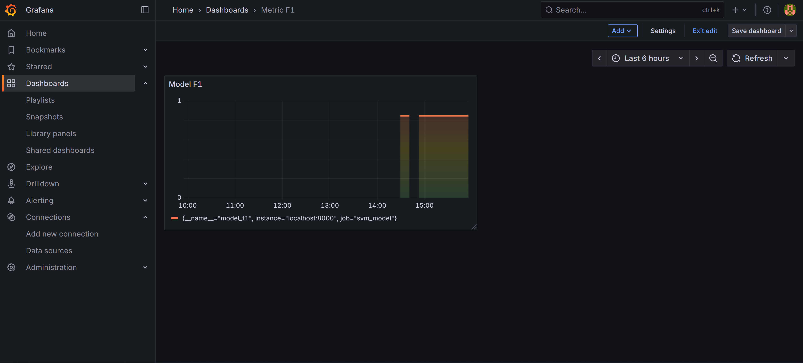
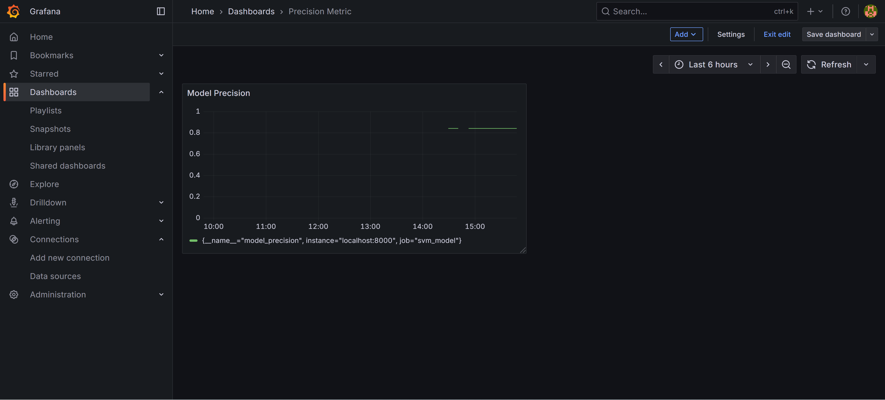
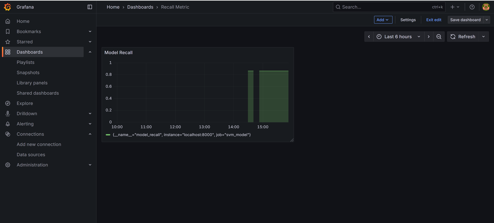

# 
 **PROJECT: Wine Quality Model Monitoring**  
MLOps — Prometheus + Grafana Dashboard

This project demonstrates a complete **MLOps pipeline**: training a machine learning model and setting up professional monitoring using Prometheus and Grafana.

---

### **Description**

The main objective was to build a classification model for predicting wine quality and implement real-time monitoring of its performance metrics in a production-like environment.

---

### **Dataset**

- **Name**: Wine Quality Dataset
- **Task**: Classification (predicting wine quality score)
- **Features**: `fixed acidity`, `volatile acidity`, `citric acid`, `residual sugar`, `chlorides`, `free sulfur dioxide`, `total sulfur dioxide`, `density`, `pH`, `sulphates`, `alcohol`
- **Target**: `quality`

---

### **Project Stages**

The project consists of seven main parts:

1. **Basic data analysis and familiarization**
2. **Data preprocessing and cleaning**
3. **Exploratory Data Analysis (EDA)**
4. **Feature Engineering**
5. **Machine Learning** (model training with `GridSearchCV`)
6. **Model Monitoring** (Prometheus metrics + Grafana dashboard)
7. **Conclusions**

---

### **Technologies Used**

- **ML**: `scikit-learn`, `GridSearchCV`, `pandas`, `numpy`
- **Monitoring**: `Prometheus`, Prometheus Python Client
- **Visualization**: `Grafana`
- **Model Serving**: Flask / FastAPI (for exposing metrics)
- **Others**: `joblib`, `matplotlib`, `seaborn`

---

### **Results**

- Trained and optimized classification model using GridSearchCV
- Implemented real-time metrics scraping with Prometheus
- Built an informative Grafana dashboard for model monitoring
- Model is prepared for periodic retraining

### **Grafana Dashboard Screenshots**

**Model F1 Score Monitoring**

**Model Precision Monitoring**

**Model Recall Monitoring**

---

### **Project Structure**

- `data/` — datasets
- `notebooks/` — main analysis and training notebook
- `src/` — model serving and metrics exporter code
- `prometheus/` — Prometheus configuration
- `grafana/` — Grafana dashboard configuration (JSON)
- `figures/` — screenshots of Grafana dashboards
- `models/` — saved trained models
- `requirements.txt`

---